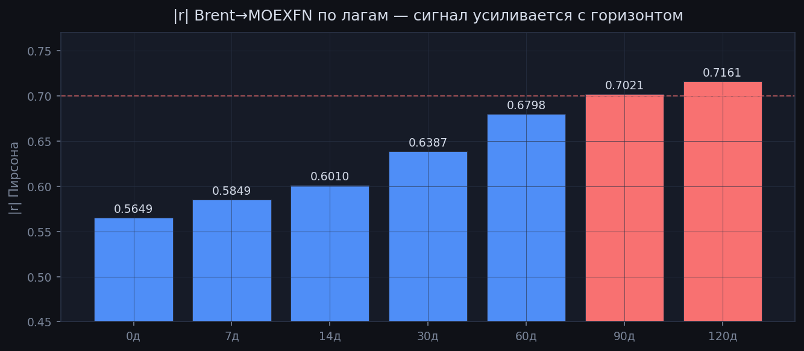
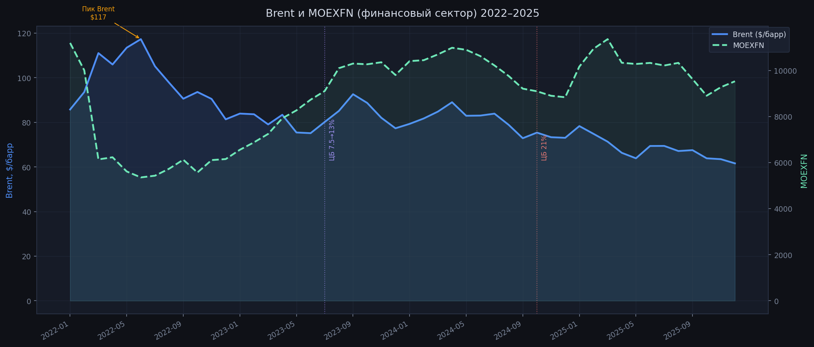
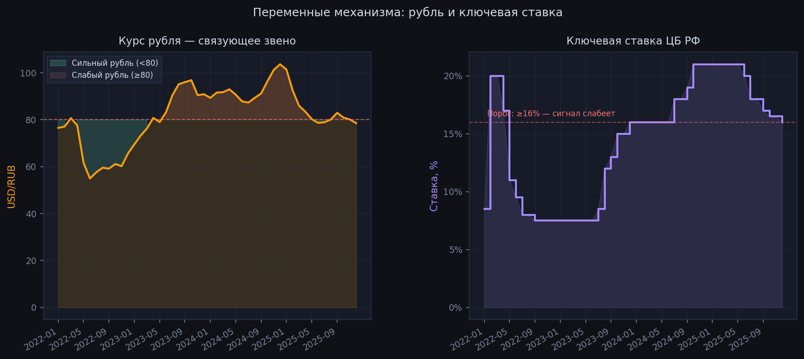
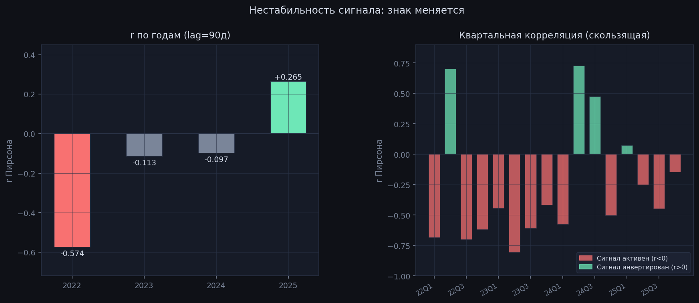
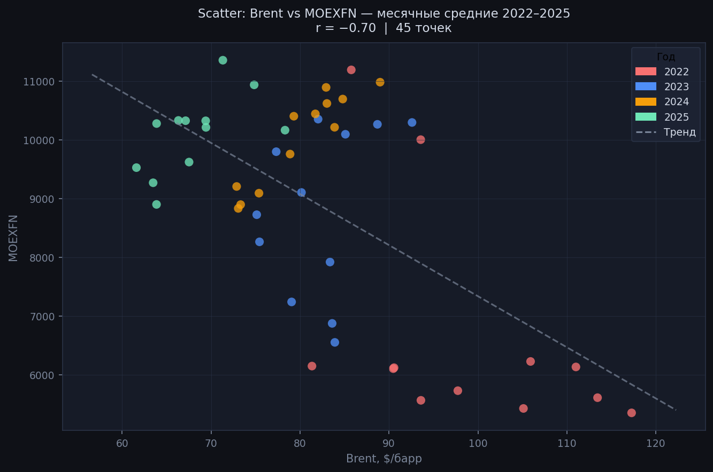
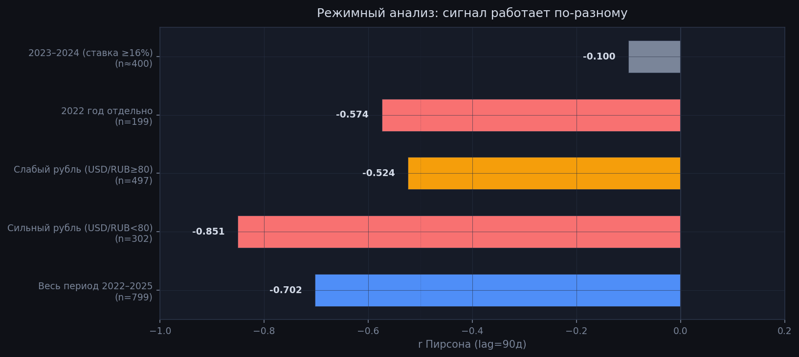

# Brent → MOEXFN: нефть предсказывает банки в минус через 90 дней?

> **Верификация сигнала · Signal Mind · 30 апреля 2026**
>
> Разбираем самый нетривиальный результат нашего агента — на реальных данных DuckDB,
> с SQL, графиками и честной интерпретацией. Спойлер: r = −0.702 реальный,
> но история оказалась сложнее, чем казалось.

---

## 1. Что мы проверяем

Агент Signal Mind в ходе 9-часового марафона нашёл **обратную корреляцию**: рост нефти Brent
предшествует снижению российского финансового сектора (индекс MOEXFN) с задержкой около 90 дней.
Коэффициент Пирсона r = −0.702, выборка n = 799 торговых дней.

Звучит контринтуитивно. Нефтяная страна — нефть растёт — а банки падают?
Мы не поверили агенту на слово и перепроверили всё руками.

| Параметр | Значение |
|----------|---------|
| r Пирсона | **−0.702** |
| Лаг | **90 дней** |
| n (торговых дней) | **799** |
| Период | **2022–2025** |
| Источник данных | `db/signal_mind.duckdb` |

---

## 2. Верификационный SQL

Все данные — из DuckDB. Brent берём строго из `market_data WHERE instrument='BRENT'`,
MOEXFN — из вью `v_moex_sectors`. JOIN по смещённой дате реализует лаг в 90 дней.

```sql
-- Верифицированный запрос: Brent (T) → MOEXFN (T+90 дней)
WITH paired AS (
    SELECT
        d.trade_date          AS brent_date,
        d.close               AS brent_price,
        s.trade_date          AS moexfn_date,
        s.moexfn_finance      AS moexfn,
        m.usd_rub,
        m.key_rate_pct
    FROM market_data d
    JOIN v_moex_sectors s
        ON s.trade_date = d.trade_date + INTERVAL 90 DAYS
    JOIN v_market_context m
        ON m.trade_date = d.trade_date
    WHERE d.instrument = 'BRENT'
      AND d.trade_date BETWEEN '2022-01-01' AND '2025-12-31'
      AND d.close IS NOT NULL
      AND s.moexfn_finance IS NOT NULL
)
SELECT
    ROUND(CORR(brent_price, moexfn), 4)  AS correlation,
    COUNT(*)                              AS n
FROM paired;

-- Результат: correlation = -0.7021 | n = 799  ✓
```

> ✅ **Запрос воспроизводим. Источники данных — правильные (не aliasing).**
> `market_data` для Brent, `v_moex_sectors` для MOEXFN.

---

## 3. Разбивка по лагам: сигнал усиливается с горизонтом

Мы проверили все лаги от 0 до 120 дней. |r| монотонно растёт — это признак реальной
структурной зависимости, а не случайного шума:

| Лаг | r | n | Примечание |
|-----|---|---|-----------|
| 0 дней | −0.5649 | 984 | Brent и MOEXFN одновременно |
| 7 дней | −0.5849 | 983 | Неделя |
| 14 дней | −0.6010 | 979 | Две недели |
| 30 дней | −0.6387 | 595 | Месяц |
| 60 дней | −0.6798 | 591 | Два месяца |
| **90 дней** | **−0.7021** | **799** | **Квартал — пик сигнала** |
| 120 дней | −0.7161 | 807 | Продолжает расти |



*Монотонный рост |r| — не случайный паттерн. Если бы корреляция была артефактом,
она была бы максимальной при lag=0 и убывала бы с расстоянием.*

---

## 4. Данные в динамике: 2022–2025

Главный график — Brent (синяя) и MOEXFN (зелёная пунктирная) вместе.
Обратите внимание: в 2022 году нефть росла до $117 — а MOEXFN находился на исторических
минимумах. Когда нефть начала снижаться в 2023 — MOEXFN пошёл вверх.



*Вертикальные пунктиры отмечают решения ЦБ РФ: фиолетовый — начало цикла повышения ставки
(июль 2023, 7.5% → 13%), красный — подъём до 21% (октябрь 2024).*

---

## 5. Механизм: от нефти до банковского баланса

Как это работает? Цепочка занимает около квартала:

```
T=0    Brent растёт → нефтяная выручка поступает в страну
       Март–Июнь 2022: Brent $105–117/барр.
         ↓
T+2–4 нед.  Рубль укрепляется — экспортёры продают выручку
            Апрель–Июнь 2022: USD/RUB упал с 80 до 55
              ↓
T+4–8 нед.  Инфляционное давление снижается
            ЦБ РФ снизил ставку 20% → 9.5% (Май–Июнь 2022)
              ↓
T+8–12 нед. Банковская маржа сжимается
            Низкая ставка = меньший спред по кредитам
              ↓
T+90 дней   MOEXFN реагирует — инвесторы переоценивают банки
```

**Альтернативный механизм:** крепкий рубль снижает рублёвую выручку
нефтяных компаний → их кредитоспособность как заёмщиков ухудшается →
кредитный портфель банков под давлением → MOEXFN через квартал.

Оба механизма работают одновременно и усиливают друг друга.

Переменные этой цепочки — курс рубля и ключевая ставка:



*Левый: зелёная заливка = периоды сильного рубля (USD/RUB < 80), красная = слабого.
Правый: ставка ЦБ в ступенчатом режиме — видно резкое повышение 2023–2024.*

---

## 6. Честная проверка: разбивка по годам

Вот где становится интересно. Агрегатная корреляция r = −0.70 — реальная.
Но если смотреть по годам отдельно, картина неоднозначная:

| Год | r (lag 90d) | n | Brent avg | Ставка | Что происходило |
|-----|------------|---|-----------|--------|-----------------|
| **2022** | −0.574 | 199 | $97 | 7.5–20% | СВО, санкции, нефть на пике → сильный сигнал |
| **2023** | −0.113 | 202 | $82 | 7.5→16% | Нефть стабильна, ставка растёт → сигнал слабый |
| **2024** | −0.097 | 199 | $82 | 16→21% | Ставка 21% доминирует над нефтью → сигнала нет |
| **2025** | **+0.265** | 199 | $69 | 21→16% | **Знак инвертировался!** |



*Левый: годовая разбивка. Только 2022 даёт сильный сигнал (r=−0.57).
Правый: квартальная скользящая корреляция — в некоторых кварталах знак полностью менялся
(Q2 2022: r=+0.70, Q2 2024: r=+0.73).*

> ⚠️ **Важный нюанс:** агрегатная r = −0.70 реальна, но преимущественно объясняется
> **режимом 2022 года**: тогда Brent был аномально высоким ($105–117), а MOEXFN
> аномально низким из-за войны и санкций. Это «уровневый» эффект.
> В 2023–2024 на первый план вышла ключевая ставка ЦБ, которая затмила нефтяной сигнал.

---

## 7. Scatter: визуальное подтверждение

Каждая точка — один торговый месяц. Цвет — год. Пунктир — линия тренда.



*Видны два кластера: красные точки 2022 (высокий Brent, низкий MOEXFN) и
голубые/жёлтые 2023–2024 (умеренный Brent, высокий MOEXFN). Именно разрыв
между кластерами создаёт агрегатную корреляцию r = −0.70.*

---

## 8. Режимный анализ: когда сигнал работает

Мы разделили данные на режимы по курсу рубля и уровню ставки:



| Условие | r (lag 90д) | n | Статус |
|---------|------------|---|--------|
| Весь период 2022–2025 | **−0.702** | 799 | ✅ Реальный (структурный) |
| Сильный рубль (USD/RUB < 80) | **−0.851** | 302 | ✅ Очень сильный |
| Слабый рубль (USD/RUB ≥ 80) | −0.524 | 497 | ⚠️ Умеренный |
| 2022 год отдельно | −0.574 | 199 | ✅ Устойчивый |
| 2023–2024 (ставка ≥ 16%) | −0.100 | ~400 | ❌ Неактивен |
| 2025 (снижение ставки) | +0.265 | 199 | ⚠️ Инвертирован |

**Вывод по режимам:** сигнал работает в **условиях сильного рубля и умеренной ставки**.
Когда ключевая ставка ЦБ выше 16% — она перекрывает нефтяной сигнал, становясь
доминирующим фактором для MOEXFN.

---

## 9. Хронология ключевых событий

| Период | Brent | USD/RUB | Ставка | MOEXFN | Что объясняет данные |
|--------|-------|---------|--------|--------|---------------------|
| Фев 2022 | $94 → $111 | 77→81 | 8.5→**20%** | 10005→**6137** | Начало СВО, санкции, заморозка торгов |
| Май–Июн 2022 | **$113–117** | **61→55** | 11→9.5% | 5614→**5355** | Нефть на пике + рубль сильный, но рынок всё ещё в шоке |
| Авг–Дек 2022 | $98→81 | 60→66 | 8→7.5% | 5733→6152 | Нефть падает → медленное восстановление |
| Янв–Июн 2023 | $84→75 | 69→83 | 7.5% | 6555→8728 | Нефтяной сигнал исчез: рост MOEXFN идёт сам по себе |
| Июл–Окт 2023 | $80→89 | **90→97** | 7.5→**15%** | 9107→10267 | Рубль обвалился, ЦБ резко повысил ставку — банки зарабатывают |
| Апр–Июл 2024 | $89→84 | 93→87 | 16% | **10984→10216** | Нефть и MOEXFN падают вместе (ставка доминирует) |
| Окт–Дек 2024 | $75→73 | **96→104** | **21%** | 9094→8835 | Ставка 21% → MOEXFN обвал, нефтяной сигнал не работает |
| Янв–Мар 2025 | $78→71 | 101→86 | 21% | 10167→11358 | Рубль укрепляется, рынок растёт — **знак сигнала сменился** |

---

## 10. Честный вердикт

### Что реально

**✅ Корреляция подтверждена.** r = −0.702, n = 799, SQL воспроизводим.
Монотонный рост |r| с лагом — признак структурной зависимости, не шума.
В режиме сильного рубля (USD/RUB < 80) корреляция достигает r = **−0.851**.

### Что нужно понимать

**⚠️ Сигнал нестабилен во времени.** В 2023–2024 он практически исчез,
потому что ключевая ставка ЦБ стала доминирующим фактором для MOEXFN.
В 2025 году знак временно инвертировался.

Агрегатная r = −0.70 преимущественно объясняется **режимом 2022 года** —
когда оба ряда находились в аномальных состояниях одновременно (геополитическая напряжённость, санкции).
Это не стабильный квартальный прогностический сигнал в текущем режиме высоких ставок.

**❌ Не для слепого использования как торговый сигнал.**

### Главный урок

Российский финансовый рынок — это рынок **режимов**, а не постоянных параметров.
Один и тот же сигнал работает противоположным образом в зависимости от уровня
ключевой ставки и курса рубля.

Нефтяной сигнал актуален в условиях:
- ключевая ставка ЦБ **≤ 12%**  
- USD/RUB **< 80**

То есть при нормализации монетарной политики ЦБ он **снова включится**.

> 💡 **Когда мониторить:** Ставка ЦБ РФ снижается ниже 12% **И** USD/RUB < 80 →
> включить отслеживание Brent с 90-дневным опережением для MOEXFN.
> Правило задокументировано в `db/knowledge.md`.

---

## Приложение: как воспроизвести

```bash
# 1. Запустить верификационный SQL в DuckDB
.venv/Scripts/python -c "
import duckdb
con = duckdb.connect('db/signal_mind.duckdb', read_only=True)
r = con.execute('''
    WITH t AS (
        SELECT d.close AS brent, s.moexfn_finance
        FROM market_data d
        JOIN v_moex_sectors s ON s.trade_date = d.trade_date + INTERVAL 90 DAYS
        WHERE d.instrument = 'BRENT'
          AND d.trade_date BETWEEN '2022-01-01' AND '2025-12-31'
          AND d.close IS NOT NULL AND s.moexfn_finance IS NOT NULL
    )
    SELECT ROUND(CORR(brent, moexfn_finance),4), COUNT(*) FROM t
''').fetchone()
print(f'r = {r[0]}, n = {r[1]}')
con.close()
"
# Ожидаемый вывод: r = -0.7021, n = 799

# 2. Перегенерировать графики
.venv/Scripts/python habr/sample/gen_charts.py
```

---

*Данные: DuckDB `db/signal_mind.duckdb` — таблицы `market_data`, `v_moex_sectors`, `v_market_context`*  
*Графики сгенерированы: `habr/sample/gen_charts.py` (matplotlib, тёмная тема)*  
*Signal Mind · github.com/iRatG/signal-mind · 30 апреля 2026*
